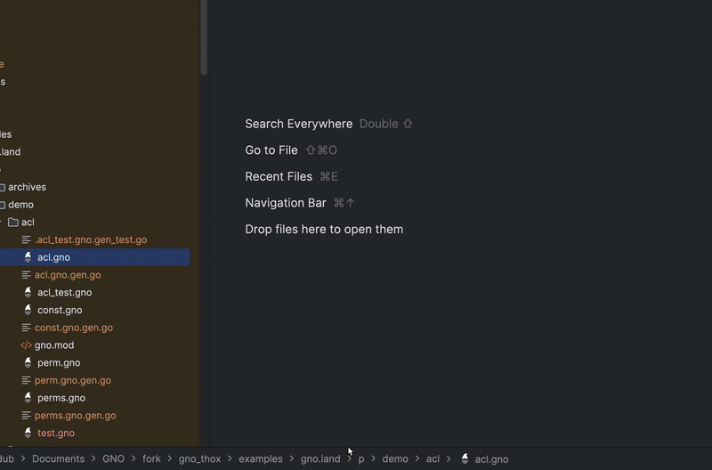
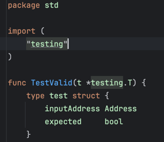
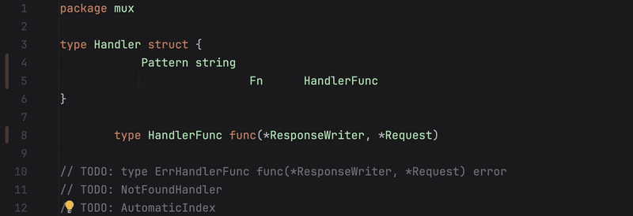
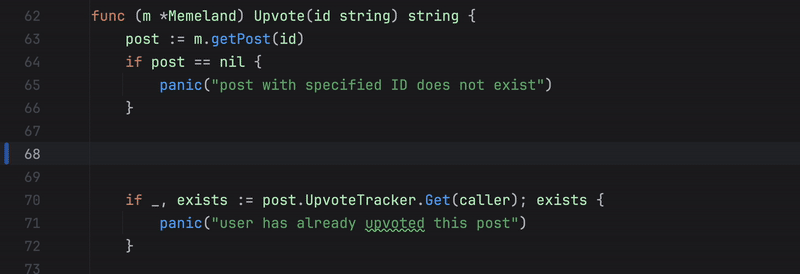
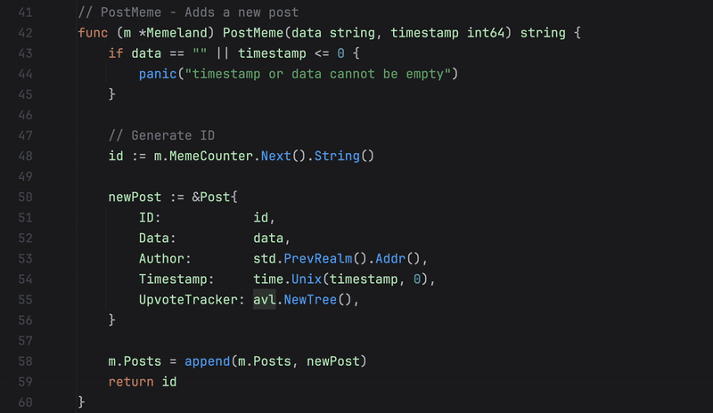
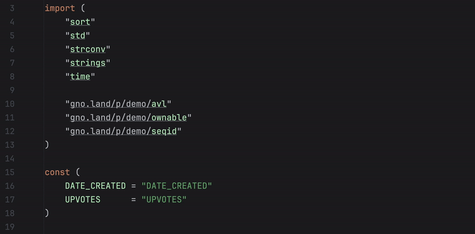
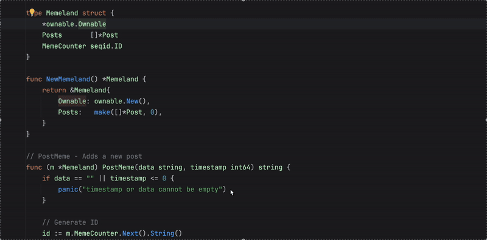
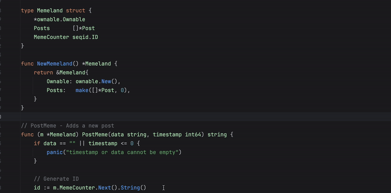
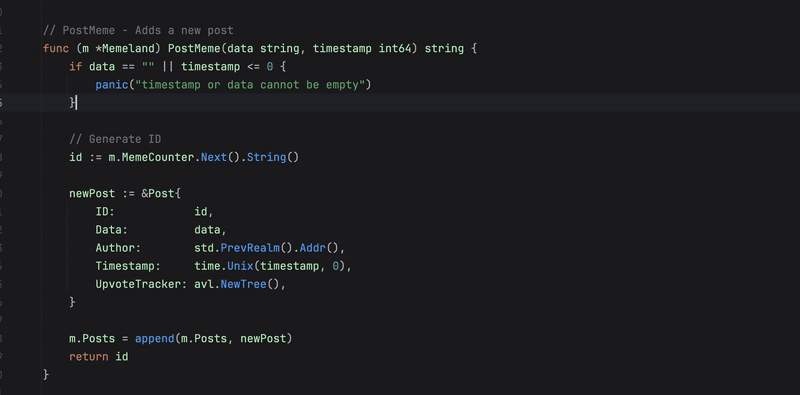
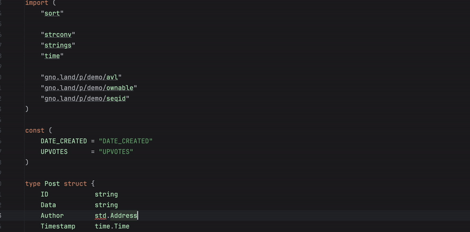

# Features

This document describes the features supported by this extension.

## Table of Contents
- [Gnopls](#gnopls)
- [Highlighting](#highlighting)
- [Formatting](#formatting)
- [IntelliSense](#intellisense)
- [Navigation](#navigation)
- [Doc](#doc)
- [Rename Symbol](#rename-symbole)
- [Find Reference](#find-reference)
- [Find Implementation](#find-implementation)
- [Auto Install Import](#auto-install-import)

## Gnopls
- `gnopls` is automatically installed if the binary is not on the user's machine

 

## Highlighting
The default syntax highlighting for gno files is implemented using `DefaultSemanticTokensColorsProvider` come to LSP4IJ extension

 

## Formatting
Format code and organize imports, either manually or on save.
`Code -> Reformat Code` or ` ⌥  ⌘ L`

 

## IntelliSense
- Code completion: Suggestions appear as you type.
- Signature help: Displays function parameters as you type.
- Quick info: Shows documentation when hovering over symbols.

 

## Navigation
`cmd + click` or `ctrl + click`

 

## Doc
`mouse over`

 

## Rename Symbole

 

## Find Reference

 

## Find Implementation

 

## Auto Install Import

 

